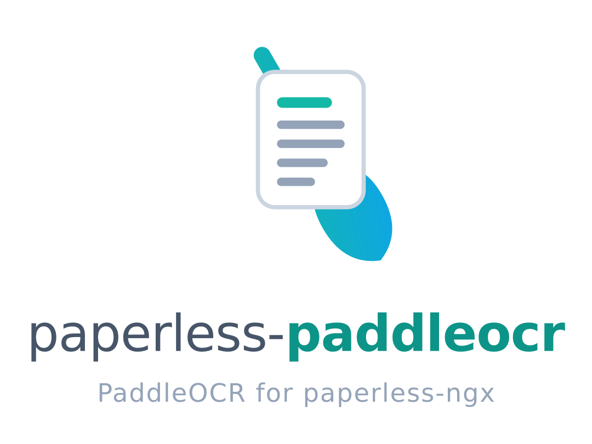

<!-- markdownlint-disable-file MD033 MD041 -->
<div align="center">
  <picture>
    <source media="(prefers-color-scheme: dark)" srcset="assets/logo-dark.png">
    
  </picture>
</div>

A drop-in [PaddleOCR](https://github.com/PaddlePaddle/PaddleOCR) provider for [paperless-ngx](https://github.com/paperless-ngx/paperless-ngx),
delivered as a parser plugin that replaces the built-in Tesseract OCR pipeline.

Paperless continues to drive `ocrmypdf` exactly as before. Existing OCR configuration
(`PAPERLESS_OCR_LANGUAGE`, `PAPERLESS_OCR_MODE`, `PAPERLESS_OCR_OUTPUT_TYPE`, `PAPERLESS_OCR_DESKEW`, `PAPERLESS_OCR_ROTATE_PAGES`, …)
keeps working, and archive PDFs remain PDF/A.

> [!NOTE]
> Requires paperless-ngx 3.x (currently in beta) with the parser plugin
> system (the `paperless_ngx.parsers` entry-point group). On older releases
> the entry point is not discovered and the plugin is silently inactive.

## Features

- Drop-in replacement for the built-in Tesseract OCR pipeline
- Honours every `PAPERLESS_OCR_*` setting (mode, output type, deskew, rotate, clean, pages, user args, …)
- Multi-language OCR with two strategies via `PAPERLESS_PADDLEOCR_MULTI_LANG_STRATEGY`:
  - `winner` (default) - pick the highest-aggregate-confidence language per document
  - `merge` - NMS-merge word boxes across languages (right choice for genuinely mixed-script pages)
- Three engine options:
  - `classic-cpu` (default) - fast CNN-based pipeline, runs locally on CPU
  - `classic-gpu` - same CNN pipeline on a local NVIDIA GPU (paddlepaddle-gpu)
  - `vl-remote` - `PaddleOCR-VL-1.5 (0.9 B VLM)` served by a separate `paddleocr-genai-vllm-server` container (remote GPU)
- Column-aware sidecar text - multi-column scans produce reading-order plain-text similar to Tesseract's output
- Output is still searchable PDF/A - generated through ocrmypdf, identical to the built-in parser

## Choosing an engine

| `PAPERLESS_PADDLEOCR_ENGINE` | Hardware | Paddle wheel | Image recipe | Throughput / accuracy notes |
| --- | --- | --- | --- | --- |
| `classic-cpu` (default) | x86_64 CPU | `paddlepaddle` | [`Dockerfile.classic-cpu`](examples/Dockerfile.classic-cpu) | Roughly 1-3 pages/sec on a modern CPU (rough guidance, not a benchmark). No GPU needed. Right default for most deployments. |
| `classic-gpu` | Local NVIDIA GPU | `paddlepaddle-gpu` | [`Dockerfile.classic-gpu`](examples/Dockerfile.classic-gpu) | Fast classic pipeline accelerated on a local GPU. Same accuracy as CPU, lower latency. |
| `vl-remote` | Remote NVIDIA host | `paddlepaddle` (CPU layout only) | [`Dockerfile.vl-remote`](examples/Dockerfile.vl-remote) + `paddleocr-genai-vllm-server` sidecar | Much higher accuracy on small fonts, low-DPI scans, handwriting. Per-page latency depends on the remote GPU - expect tens of seconds per page. |

## Installation

Build the plugin into a custom paperless-ngx image - the recipe Dockerfiles under [`examples/`](examples/)
fetch the plugin source from this repository at build time and bake the wheel into the paperless-ngx base image.

Pick the method that matches your environment:

| Method | When to use |
| --- | --- |
| **A. Custom Docker image (recommended)** | Docker / Docker Compose deployments. Works for every engine including `classic-gpu`. |
| **B. Bootstrap script** | Managed paperless containers where you can mount into `/custom-cont-init.d/` but cannot rebuild the image. |
| **C. Non-Docker host install** | paperless-ngx running directly on a host / VM. |

### A. Custom Docker image (recommended)

Each engine has a matching recipe Dockerfile that pulls plugin source from a chosen Git ref, builds the wheel, and layers it
plus the right paddle wheel onto `ghcr.io/paperless-ngx/paperless-ngx:beta`. Build args:

- `PLUGIN_REF` - Git ref to build from. Use a release tag (`v0.1.0`) for reproducible builds; `master` tracks the latest snapshot.
- `PAPERLESS_TAG` - paperless-ngx base image tag (default `beta`).

#### `classic-cpu`

```bash
docker build \
    --build-arg PLUGIN_REF=v0.1.0 \
    -f examples/Dockerfile.classic-cpu \
    -t paperless-paddleocr:classic-cpu .
```

Drop-in replacement for `ghcr.io/paperless-ngx/paperless-ngx:beta`. Compose example:
[`examples/docker-compose.classic-cpu.yml`](examples/docker-compose.classic-cpu.yml).

#### `classic-gpu`

For local-GPU inference with `paddlepaddle-gpu`. Additional build arg:

- `CUDA_WHEEL` - which Paddle GPU index to pull from:

| `CUDA_WHEEL` | CUDA | Hardware |
| --- | --- | --- |
| `cu126` (default) | 12.6 | Ampere (CC 8.0), Ada (CC 8.9), Hopper (CC 9.0) |
| `cu129` | 12.9 | Blackwell (RTX 50-series, sm_120) |

```bash
docker build \
    --build-arg PLUGIN_REF=v0.1.0 \
    --build-arg CUDA_WHEEL=cu126 \
    -f examples/Dockerfile.classic-gpu \
    -t paperless-paddleocr:classic-gpu .
```

The image bundles the matching CUDA-12 user-space libs (`libcudnn9-cuda-12`, `libnccl2`). `libcuda.so` itself comes from the
host driver at runtime via `nvidia-container-toolkit` - the container needs `deploy.resources.reservations.devices` (compose)
or `--gpus all` (`docker run`). Compose example:
[`examples/docker-compose.classic-gpu.yml`](examples/docker-compose.classic-gpu.yml).

If you really need CUDA 11.8 (older drivers), edit the Dockerfile to swap the cuDNN/NCCL apt packages
(`libcudnn9-cuda-12 libnccl2` → `libcudnn8` + the matching CUDA-11 runtime libs from NVIDIA's apt repo) and pass
`--build-arg CUDA_WHEEL=cu118`.

#### `vl-remote`

CPU paddle wheel locally (only layout analysis runs on the paperless side), plus a separate `paddleocr-genai-vllm-server`
container that owns the GPU and serves the VLM.

```bash
docker build \
    --build-arg PLUGIN_REF=v0.1.0 \
    -f examples/Dockerfile.vl-remote \
    -t paperless-paddleocr:vl-remote .
```

Full compose stack with the sidecar GPU server:
[`examples/docker-compose.vl-remote.yml`](examples/docker-compose.vl-remote.yml) along with a tuned
[`examples/vllm_config.yaml`](examples/vllm_config.yaml).

### B. Bootstrap script (Compose, no custom image)

For paperless deployments where mounting into `/custom-cont-init.d/` is easier than rebuilding the image:

- [`setup.sh`](setup.sh) - installs CPU paddlepaddle + the plugin tarball.
- [`setup-gpu.sh`](setup-gpu.sh) - installs paddlepaddle-gpu (configurable via `PADDLE_CUDA_WHEEL`) + the plugin tarball.

Both scripts require a `paperless-paddleocr.tar.gz` (or `paperless_paddleocr-*.whl`) next to them - see
[`examples/extract-wheel/README.md`](examples/extract-wheel/README.md). For GPU, the base image must already provide
the CUDA / cuDNN runtime; otherwise prefer Method A with `Dockerfile.classic-gpu`.

### C. Non-Docker host install

```bash
# 1. Install native libs (Debian/Ubuntu shown; see extract-wheel/README.md for other distros).
sudo apt-get install -y --no-install-recommends \
    libgl1 libglib2.0-0 libsm6 libxext6 libxrender1 libgomp1

# 2. Install one paddle wheel.
pip install "paddlepaddle>=3.0"   # CPU
# …or, for GPU:
pip install --index-url https://www.paddlepaddle.org.cn/packages/stable/cu126/ paddlepaddle-gpu

# 3. Install the plugin from a Git ref.
pip install "git+https://github.com/flobernd/paperless-paddleocr.git@v0.1.0"
```

For the `vl-remote` engine install the `vl` extra instead:

```bash
pip install "paperless-paddleocr[vl] @ git+https://github.com/flobernd/paperless-paddleocr.git@v0.1.0"
```

Then restart paperless-ngx; the parser is discovered via its `paperless_ngx.parsers` entry point. Full recipe and
wheel-extraction alternative: [`examples/extract-wheel/README.md`](examples/extract-wheel/README.md).

## Docker Compose Example

Minimal CPU-only stack:

```yaml
services:
  paperless:
    build:
      context: ./examples
      dockerfile: Dockerfile.classic-cpu
      args:
        PLUGIN_REF: v0.1.0
    image: paperless-paddleocr:classic-cpu
    restart: unless-stopped
    volumes:
      - paperless_data:/usr/src/paperless/data
      - paperless_media:/usr/src/paperless/media
      - paddlex_cache:/usr/src/paperless/.paddlex   # persist downloaded weights
      # … your other paperless volumes …
    environment:
      PAPERLESS_OCR_LANGUAGE: eng
      PAPERLESS_OCR_MODE: auto
      PAPERLESS_OCR_OUTPUT_TYPE: pdfa
      PAPERLESS_PADDLEOCR_ENGINE: classic-cpu
      # PAPERLESS_PADDLEOCR_LANGUAGE: ml   # if your documents mix scripts

volumes:
  paperless_data:
  paperless_media:
  paddlex_cache:
```

Full ready-to-run variants:

- [`examples/docker-compose.classic-cpu.yml`](examples/docker-compose.classic-cpu.yml) - CPU only.
- [`examples/docker-compose.classic-gpu.yml`](examples/docker-compose.classic-gpu.yml) - local GPU; needs `nvidia-container-toolkit`.
- [`examples/docker-compose.vl-remote.yml`](examples/docker-compose.vl-remote.yml) - paperless (CPU) + `paddleocr-genai-vllm-server` (GPU) sidecar.

On first startup the container will:

1. Build (or pull, if already built) the custom image - the plugin and its Python deps come baked in.
2. Discover this package via the `paperless_ngx.parsers` entry point. Look for this log line:

   ```text
   Loaded third-party parser 'Paperless-ngx PaddleOCR Parser' v0.1.0 by Florian Bernd (entrypoint: 'paddleocr').
   ```

3. Route ingested documents through PaddleOCR instead of Tesseract. Each document logs:

   ```text
   Document handled by third-party parser 'Paperless-ngx PaddleOCR Parser' v0.1.0 …
   ```

### Updating

Re-build the custom image with a newer `PLUGIN_REF` and recreate the container. The `paddleocr-genai-vllm-server` sidecar
(for `vl-remote`) is updated independently by pulling a newer image tag.

## Notes

> [!NOTE]
> CUDA dependencies live in the runtime image, not the plugin wheel. The same plugin wheel works on both CPU and GPU images;
> the recipe Dockerfile picks `paddlepaddle` or `paddlepaddle-gpu`.

> [!NOTE]
> Classic PaddleOCR (CPU or GPU) downloads ~50 MB of model weights on first use and caches them under `~/.paddlex/` inside the
> container. Mount a persistent volume at `/usr/src/paperless/.paddlex` to avoid re-downloads across rebuilds - the bundled
> compose examples already do this. The `vl-remote` engine downloads nothing on the paperless side; the ~2 GB VLM lives on
> the GPU server.

> [!WARNING]
> `vl-remote` deployment: bring up the [`paddleocr-genai-vllm-server`](https://hub.docker.com/r/paddlepaddle/paddleocr-genai-vllm-server)
> Docker image first, point `PAPERLESS_PADDLEOCR_VL_SERVER_URL` at it (e.g. `http://gpu-host:8118`), and - strongly recommended -
> set both `api-key:` inside the [`vllm_config.yaml`](examples/vllm_config.yaml) backend config and `PAPERLESS_PADDLEOCR_VL_API_KEY`
> on the paperless side to require Bearer-token auth on `/v1/*` endpoints. For Blackwell (RTX 50-series, CC 12.0) hosts, use the
> `:latest-nvidia-gpu-sm120` image tag; otherwise the `:latest-nvidia-gpu` tag covers Ampere/Ada/Hopper.

## Environment

The plugin reads its own configuration from `PAPERLESS_PADDLEOCR_*` environment variables. All standard `PAPERLESS_OCR_*` variables
(see [Honoured paperless-ngx settings](#honoured-paperless-ngx-settings)) keep working unchanged.

### `PAPERLESS_PADDLEOCR_SCORE`

Parser-registry priority. Higher scores win when more than one parser claims the same MIME type. The built-in Tesseract parser scores
`10`, so the default makes PaddleOCR preferred whenever this plugin is installed. Set to `5` to defer to Tesseract while keeping the
plugin available.

Default: `15`.

### `PAPERLESS_PADDLEOCR_ENGINE`

Selects the PaddleOCR engine variant:

- `classic-cpu` - fast CNN-based pipeline running locally on CPU (recommended default for most workloads).
- `classic-gpu` - same CNN pipeline on a local NVIDIA GPU. Requires `paddlepaddle-gpu` installed in the image and a CUDA device
  visible to the container; `check_options` fails fast if either is missing.
- `vl-remote` - [PaddleOCR-VL-1.5](https://github.com/PaddlePaddle/PaddleOCR), a 0.9 B-parameter VLM served by a sidecar
  `paddleocr-genai-vllm-server` container. The paperless side still runs the layout-analysis step locally on CPU; only the
  VLM-recognition step goes remote. Higher accuracy on small fonts, low-DPI scans, and handwritten text.

Default: `classic-cpu`.

### `PAPERLESS_PADDLEOCR_VL_SERVER_URL`

URL of the `paddleocr-genai-vllm-server` endpoint. Required when `PAPERLESS_PADDLEOCR_ENGINE=vl-remote`; ignored otherwise.

Example: `http://gpu-host:8118`.

Default: *unset*.

### `PAPERLESS_PADDLEOCR_VL_MODEL_NAME`

`served-model-name` that the inference server advertises. Must match whatever the server was launched with (the official Baidu image
defaults to `PaddleOCR-VL-1.5-0.9B`).

Default: `PaddleOCR-VL-1.5-0.9B`.

### `PAPERLESS_PADDLEOCR_VL_API_KEY`

Bearer token for the remote `/v1/*` endpoints. When set, the OpenAI client sends `Authorization: Bearer <token>` on every
request, and the server (configured via `api-key:` in its `vllm_config.yaml`) rejects unauthenticated traffic.

> [!WARNING]
> vLLM's `--api-key` only protects `/v1/*` endpoints; other endpoints (`/health`, `/metrics`, `/invocations`) stay unauthenticated.
> For untrusted networks, put nginx/Caddy in front of the inference server with endpoint allowlisting and TLS.

Default: *unset* (no authentication header is sent).

### `PAPERLESS_PADDLEOCR_VL_PIPELINE_VERSION`

PaddleOCR-VL pipeline version used on the paperless side (`v1`, `v1.5`, `v1.6`). Must
match the model family the inference server serves: keep `v1.5` for the documented
`PaddleOCR-VL-1.5-0.9B` server; set `v1.6` together with
`PAPERLESS_PADDLEOCR_VL_MODEL_NAME` when the server runs a 1.6 model.

Default: `v1.5`.

### `PAPERLESS_PADDLEOCR_MULTI_LANG_STRATEGY`

How to combine results when `PAPERLESS_OCR_LANGUAGE` lists more than one language:

- `winner` (default) - run each language pass, pick the one with the highest aggregate word confidence, and use its hOCR as-is.
  Faster and more consistent for documents whose pages are single-script.
- `merge` - NMS-merge word boxes from all language passes by confidence. Right choice for genuinely mixed-script pages.

Single-language input ignores this setting (there's only one pass to run).

Default: `winner`.

### `PAPERLESS_PADDLEOCR_LANGUAGE`

Override that bypasses the Tesseract → PaddleOCR language map. When set, takes precedence over `PAPERLESS_OCR_LANGUAGE` for OCR only
(paperless's own search / NLTK integration still reads `PAPERLESS_OCR_LANGUAGE`).

Use this to pass native PaddleOCR codes that have no Tesseract analogue:

- Single-script models: `en`, `german`, `fr`, `es`, `ch`, `japan`, `korean`, ...
- Script bundles: `ml`, `latin`, `arabic`, `cyrillic`, `devanagari`. These are 2.x-era
  names that the plugin translates for PaddleOCR 3.x: `ml` selects the default
  multilingual PP-OCRv6 model, the others select the matching script recognition model.

> [!TIP]
> Setting this to one of the multi-script models is the recommended way to OCR documents that mix scripts without paying the
> per-page-per-language cost of the multi-language merge.

Default: *unset* (Tesseract codes from `PAPERLESS_OCR_LANGUAGE` are translated automatically).

## Honoured paperless-ngx settings

All `PAPERLESS_OCR_*` settings are honoured transparently - they are read from the same `OcrConfig` dataclass that the Tesseract
parser uses, then passed to `ocrmypdf.ocr()` exactly the same way:

| Setting | Effect |
| --- | --- |
| `PAPERLESS_OCR_LANGUAGE` | Tesseract codes, `+`-separated. Mapped to PaddleOCR codes internally. Multiple codes trigger the multi-language merge. |
| `PAPERLESS_OCR_MODE` | `auto` / `force` / `redo` / `off` (`off` skips OCR entirely and just produces PDF/A - no PaddleOCR invoked). |
| `PAPERLESS_OCR_OUTPUT_TYPE` | `pdf` / `pdfa` / `pdfa-1` / `pdfa-2` / `pdfa-3`. |
| `PAPERLESS_OCR_CLEAN` | `clean` / `clean-final` / `none`. |
| `PAPERLESS_OCR_DESKEW` | Pre-OCR deskew, estimated by a projection-profile analysis of the page raster (range ±5°). |
| `PAPERLESS_OCR_ROTATE_PAGES`, `PAPERLESS_OCR_ROTATE_PAGES_THRESHOLD` | Pre-OCR page rotation via PaddleOCR's document orientation classifier. The threshold compares against a probability percentage (0-100); raise it to rotate more conservatively. |
| `PAPERLESS_OCR_PAGES` | OCR only the first N pages. |
| `PAPERLESS_OCR_IMAGE_DPI` | Fallback DPI for images without DPI metadata. |
| `PAPERLESS_OCR_COLOR_CONVERSION_STRATEGY` | Ghostscript color strategy for PDF/A. |
| `PAPERLESS_OCR_MAX_IMAGE_PIXELS` | Max pixels per page. |
| `PAPERLESS_OCR_USER_ARGS` | JSON-encoded extra kwargs merged into the ocrmypdf call. |
| `PAPERLESS_ARCHIVE_FILE_GENERATION` | Whether to produce searchable PDFs. |

## Language handling

PaddleOCR uses different language codes from Tesseract and runs a single language per pass. The plugin handles this in two steps:

1. **Mapping** - `eng` → `en`, `deu` → `german`, `spa` → `es`, `chi_sim` → `ch`, etc.
   Codes without a PaddleOCR 3.x model (for example `heb`) are logged and dropped. The
   full table is in [`paperless_paddleocr/languages.py`](paperless_paddleocr/languages.py).
2. **Multi-language combination** - when more than one code remains after mapping, the plugin runs PaddleOCR once per language and
   combines the results according to `PAPERLESS_PADDLEOCR_MULTI_LANG_STRATEGY`. The default `winner` picks the language whose pass
   has the highest aggregate confidence and uses its hOCR as-is; `merge` runs an NMS over word boxes from every pass and keeps the
   highest-confidence box per location. Either way, per-page wall time scales linearly with the number of languages because each
   pass still runs.

If you need broad multi-script coverage without paying that cost, set `PAPERLESS_PADDLEOCR_LANGUAGE` to one of the bundled
multilingual models: `ml`, `latin`, `arabic`, `cyrillic`, `devanagari`.

> [!NOTE]
> For languages written without inter-word spaces (Chinese, Japanese, Thai, ...) the
> invisible text layer carries line-level rather than word-level boxes, so search-hit
> highlighting in PDF viewers selects whole lines. Extracted text and search results are
> unaffected.

## Performance notes

- **Multi-language combination is `N×` slower** than single-language: every pass still runs. Use `PAPERLESS_PADDLEOCR_LANGUAGE=ml`
  for a single-pass multi-script model when accuracy on each individual language matters less than throughput. The choice of
  `winner` vs `merge` doesn't change OCR cost - only how the per-language hOCRs are combined afterwards.
- **`vl-remote` engine** is much more accurate on small fonts, low-DPI scans, and handwritten text - but it requires a separate
  GPU host running `paddleocr-genai-vllm-server`. Per-page latency depends on the server GPU; expect tens of seconds per page
  depending on the GPU.
- **`classic-cpu` engine** runs entirely on CPU. On a modern x86_64 host it handles roughly 1-3 pages/sec on typical scans as
  rough guidance - usually fast enough for paperless's ingest rates; measure on your own hardware to confirm. No GPU required.
- **`classic-gpu` engine** runs the same pipeline as `classic-cpu` on a local NVIDIA GPU. Accuracy is identical; latency drops
  significantly - useful when ingesting batches faster than CPU can keep up.
- **Sidecar text** is rendered in banded reading order: columns are detected per vertical
  band, so a two-column letter head above a full-width body reads sender block, recipient
  block, body. Detection stays conservative (gutters narrower than 4% of the text span
  are ignored, and a side-by-side run shorter than 3 lines is not treated as columns).
  Rotated text and wrap-around figures can still produce odd ordering - open an issue
  with a fixture if you hit something that should be fixable.
- **Concurrency:** within one paperless worker, OCR inference runs one page at a time
  (Paddle predictors are not thread-safe); ocrmypdf still parallelises rasterisation and
  post-processing across `PAPERLESS_THREADS_PER_WORKER` threads. Scale page throughput
  with `PAPERLESS_TASK_WORKERS` (each worker process gets its own engine instance).

## Troubleshooting

### `pip install` of `paddlepaddle-gpu` fails with `No matching distribution`

`paddlepaddle-gpu` ships from Baidu's custom index:

```bash
pip install --index-url https://www.paddlepaddle.org.cn/packages/stable/cu126/ paddlepaddle-gpu
```

Pick `cu126` / `cu129` / `cu118` to match your host's CUDA driver - see
[`examples/extract-wheel/README.md`](examples/extract-wheel/README.md#gpu-notes).

### `classic-gpu` engine fails with "no CUDA device is visible"

`check_options` calls `paddle.device.cuda.device_count()` and bails out fast when it returns zero. Check:

1. The host has an NVIDIA driver installed (`nvidia-smi` runs on the host).
2. `nvidia-container-toolkit` is installed and configured for Docker.
3. The container has GPU access (`docker run --gpus all …`, or compose `deploy.resources.reservations.devices` - see
   [`examples/docker-compose.classic-gpu.yml`](examples/docker-compose.classic-gpu.yml)).
4. `paddlepaddle-gpu` (not `paddlepaddle`) is installed in the image. The recipe Dockerfile takes care of this.

### `apt-get` fails with "Could not resolve"

`setup.sh` updates package lists and installs native libraries required by PaddleOCR.
If the container cannot reach the distribution mirrors, pre-install the packages in
your base image or use a custom `Dockerfile` instead of `/custom-cont-init.d/`.

### Plugin is not discovered (no "Loaded third-party parser" log line)

1. Verify the paperless-ngx image supports the beta parser plugin system
   (`paperless_ngx.parsers` entry-point group). Older images silently ignore plugins.
2. Check that `setup.sh` exited successfully (look for "bootstrap complete" in logs), or that the recipe Dockerfile actually
   installed the plugin (`pip show paperless-paddleocr` inside the container).

### Missing `libGL.so.1` or similar at runtime

PaddleOCR's OpenCV backend requires native libraries that are not in `manylinux` wheels. The recipe Dockerfiles install them
automatically. For host-installed paperless or custom base images, install them manually:

```bash
apt-get install -y --no-install-recommends \
    libgl1 libglib2.0-0 libsm6 libxext6 libxrender1 libgomp1
```

### Classic PaddleOCR model downloads are slow on every start

PaddleOCR 3.x caches model weights under `~/.paddlex/` (the classic pipeline routes through PaddleX internally). Mount a
persistent volume at `/usr/src/paperless/.paddlex` to cache them across container rebuilds - the bundled compose examples
already do this.

## License

Released under the MIT license. See [`LICENSE`](LICENSE) for the full text.
